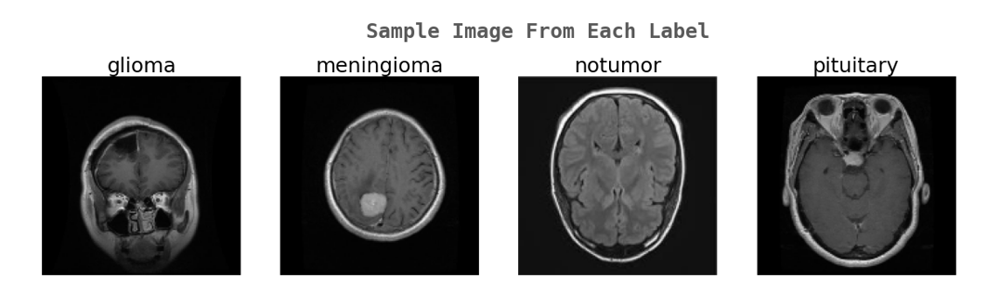
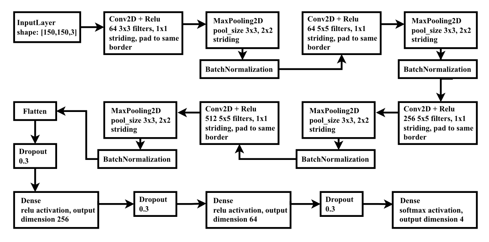
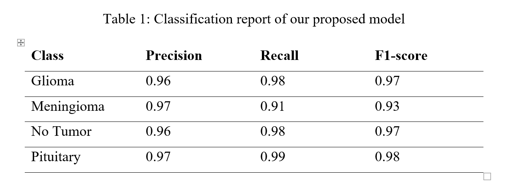
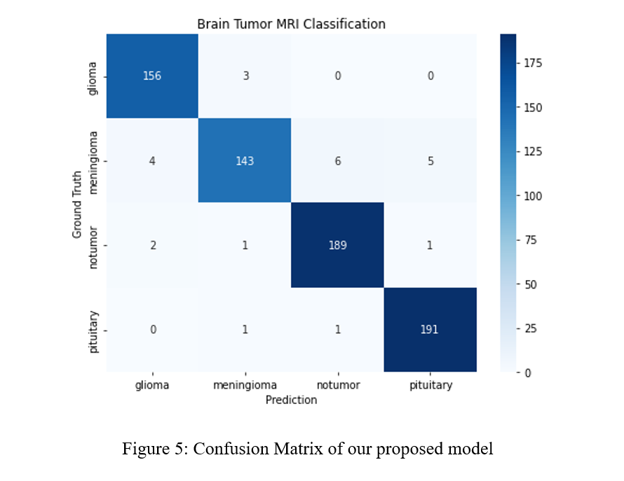
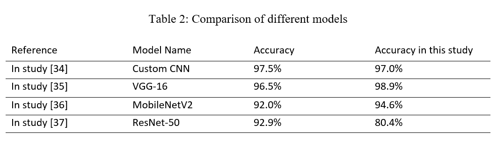

# Abstract
Brain tumors are growths of cells in the brain that grow in an abnormal, uncontrollable way. If they are not detected and treated early, they can turn into a form of cancer that is fatal. Diagnosing and classifying brain tumors is essential to treat brain cancer. This research introduced a system for the automatic classification of brain tumors using convolutional neural networks, a class of deep learning neural networks, and some of the most effective deep learning techniques, such as data augmentation, hyperparameter tuning, and transfer learning.

# Dataset
We utilized the CCO: Public Domain-licensed Kaggle Brain Tumor MRI dataset. There is a total of 7023 MRIs, which are separated into four categories: pituitary, meningioma, glioma, and no tumor. The MRI sequences included in this data set are a combination of T1-weighted, T2-weighted, and Fluid Attenuated Inversion Recovery (FLAIR) sequences.
- Glioma - 1621 samples
- meningioma - 1645 samples
- No tumor - 2000 samples
- Pituitary -1757 samples

# Data Preprocessing
- Resize the pixels of the MRI's 512x512 to 150x150
- Rescale the pixel values from 0-255 to 0-1
- 90% of the dataset used for training and 10% for testing

## Data Augmentation Techiniques
- Rotating,
- Changing contrast
- Horizontal flipping

# Proposed System Architecture
A simple CNN model consisting of 4 convolution blocks and one classification block. We employed four convolution layers with 64 filters of size 3x3, 64 filters of size 5x5, 256 filters of size 5x5, and 512 filters of size 5x5, respectively, with padding = same and stride = 1. A non-linear activation function follows each convolution layer, namely Rectified Linear Unit (ReLU) and max pooling layer with the kernel size of 3x3 and stride = 2. Batch normalization, a regularization technique that normalizes the layers' inputs by re-centering and re-scaling, was employed between each convolution layer to speed up and improve the stability of artificial neural network training. Sergey Ioffe and Christian Szegedy proposed it in 2015. The classification block consists of four fully connected (FC) layers. The first layer of the classification block is the Flatten layer which is followed by a dropout layer with a dropout rate of 30%. Then two FC layers with 256 and 64 nodes were added to the architecture, followed by a dropout layer with a dropout rate of 30%. Finally, the softmax activation function was used for the dense output layer with the same units as the number of classes of Brain tumor classifications.

## Transfer Learning Models
- VGG-16
- MobileNetV2
- ResNet-50

# Result AND Analysis
## Proposed Model Accuracy and Loss
- The training accuracy of our proposed model was 97.04%, and the validation accuracy was 96.59%.
- Classification report for each class

- Confusion matrix

Only 24 out of 703 test samples were incorrectly classified. As evidenced by the confusion matrix, our custom CNN model has difficulty classifying meningioma tumors.  The model misclassified 15 out of 158 samples of meningioma types. Besides the meningioma types, the model performs better in classifying normal brain images and glioma pituitary tumors. This incident demonstrates that our proposed classification model for brain tumors is accurate and trustworthy.

## Pretrained Model Accuracy and Loss
1. VGG-16
 - Training Accuracy: 98.89%
 - Validation Accuracy: 95.59% 
2. MobileNetV2
 - Training Accuracy: 94.59%
 - Validation Accuracy: 93.31%
3. ResNet-50
 - Training Accuracy: 80.42%
 - Validation Accuracy: 82.93%

## Model Comparison

VGG-16 and MobileNetV2 performs better than the referenced studies. VGG-16 achieved highest training accuracy of 98.89% and our proposed custom CNN model achieved the second highest training accuracy of 97.04%. However, MobileNetV2 performs better than ResNet-50 in this study. ResNet-50 had the worst training accuracy of all the models that were trained.

# Conclusion
This research presented a custom CNN model for the classification of various types of brain tumors. Utilizing a database of T1-weighted, T2-weighted, and Flair sequences of MRI of glioma, meningioma, pituitary brain tumors, and normal brain, this research was conducted. The training accuracy and loss of the custom CNN model are 97.04% and 10.17%, respectively, while the validation accuracy and loss are 96.59% and 21.63%. We also trained our dataset on state-of-the-art pre-trained CNN models VGG-16, MobileNetV2, and ResNet-50. The training accuracy of VGG-16, MobileNetV2, and ResNet-50 are 98.89%, 94.59%, and 80.42%, respectively. Despite having less computing time and complexity than other state-of-the-art CNN models, our custom-built CNN model performs significantly.
